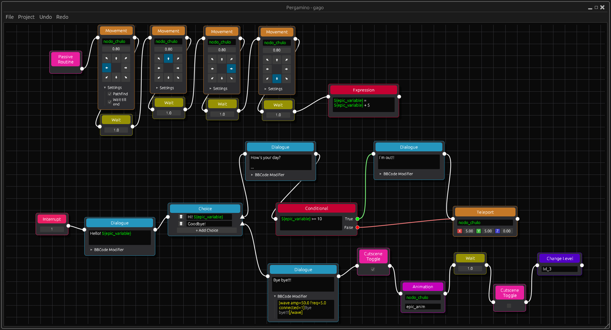

# Pergamino 📜✨


**Pergamino** is a blazing-fast, lightweight, node-based Dialogue and Event Editor built entirely in Rust. 

Designed specifically for game developers and used for my own personal projects, it allows you to visually construct complex branching narratives, logic gates, and game events. The tool exports your graph into clean, parseable JSON files, making it incredibly easy to integrate with any game engine (Godot, Unity, Unreal, or custom frameworks) via a simple interpreter.

## 🚀 Why Pergamino?

* **Visual Narrative Flow:** Replaces messy spreadsheets and raw text files with an intuitive, drag-and-drop node graph interface powered by `eframe` and `egui_snarl`.
* **Extensive Node Library:** Out-of-the-box support for the most common RPG/Adventure game events:
  * *Narrative:* Dialogues, Choices.
  * *Logic & State:* Conditionals, Expressions, Project-scoped Variables.
  * *World & Actors:* Movement, Teleport, Animation, Level Transitions.
* **Production-Ready UX:** * **Robust Undo/Redo:** Built on a strict Command Pattern architecture, ensuring you never lose your work when experimenting with complex node trees.
  * **Custom Variables & Context:** Manage custom string, number, and boolean variables directly within the editor to drive your narrative logic.
* **Engine Agnostic:** Pergamino doesn't tie you to a specific engine. It outputs flattened, lightweight JSON data that your game can easily read and execute at runtime.

## 💻 Technical Highlights

This tool isn't just about what it does, but *how* it's built. Pergamino leverages the power of Rust to provide a robust, crash-free experience:

* **High-Performance UI:** Uses Immediate Mode GUI (`egui`) for zero-lag rendering of massive node graphs.
* **Smart Architecture:** Codebase is cleanly separated into specialized modules (`ui`, `graph`, `io`, `commands`).
* **Zero-Cost Abstractions:** Utilizes macro-driven static enum dispatch (`enum_dispatch`) for node polymorphic behaviors, avoiding the runtime overhead of traditional dynamic trait objects.
* **Memory Safety:** Strict adherence to Rust's borrow checker and explicit lifetime management ensures no memory leaks or unexpected segmentation faults, which is critical for desktop tooling.

## 🛠️ Quick Start

Ensure you have the Rust toolchain (Cargo) installed.

```bash
# Clone the repository
git clone [https://github.com/alvesit0/pergamino.git](https://github.com/alvesit0/pergamino.git)
cd pergamino

# Build and run the editor
cargo run --release
```

## 📂 Architecture Overview

The project is structured to maintain high cohesion and low coupling:

* `src/ui/`: Manages the application state, windows, modals, and the custom dark theme.
* `src/graph/`: The core engine. Contains the node implementations (`src/graph/nodes/`), graph rendering logic, and connection limits.
* `src/commands/`: The Undo/Redo engine. Implements the Command Pattern for atomic graph modifications (adding/removing nodes and connections).
* `src/io/`: Handles native file dialogs and the serialization/deserialization of project data via `serde_json`.

## 👤 Author

* **Adrián Alves** - *Main Developer*
* **GitHub:** [@alvesit0](https://github.com/alvesit0)
* **LinkedIn:** [Adrián Alves](https://www.linkedin.com/in/adri%C3%A1n-alves-morales-044016141/)
* **Email:** adalvesmora@gmail.com
* **Game Portfolio:** [alvesito.itch.io](https://alvesito.itch.io)

## 📝 License
This project is open-source and available under the [MIT License](LICENSE).